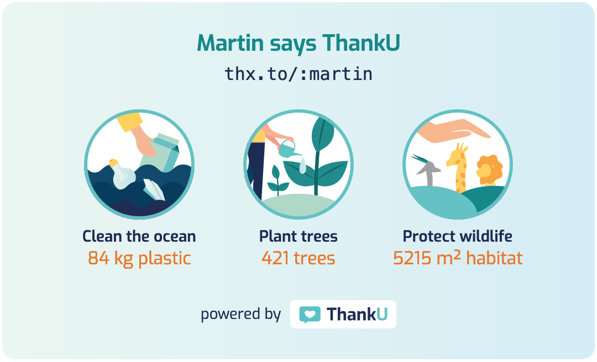

<a href="https://www.thanku.social">
  
</a>

**Say ThankU and Do Good**

# ThankU Impact Widget (Web Component)

Show your impact with ThankU on your website.



**See working examples here: https://thanku.github.io/impact-widget/**

We make use of the latest browser features ([Web Components](https://developer.mozilla.org/en-US/docs/Web/Web_Components), [module scripts](https://developer.mozilla.org/en-US/docs/Web/JavaScript/Guide/Modules), [fetch](https://developer.mozilla.org/en-US/docs/Web/API/Fetch_API), [CSS variables](https://developer.mozilla.org/en-US/docs/Web/CSS/--*), etc.) which are well supported in current versions of [Google Chrome](https://www.google.com/chrome/), [Mozilla Firefox](https://www.mozilla.org/en-US/firefox/new/), [Apple Safari](https://www.apple.com/safari/) and [Microsoft Edge](https://www.microsoft.com/en-us/edge). If you need to target older browser versions or Microsoft Internet Explorer, you need to provide appropriate polyfills.

Under the hood we use the awesome [hybrids](https://hybrids.js.org), a UI library for creating Web Components, via CDN import.

## Installation

### Self hosted

Add the following to an HTML document:

```html
<script type="module" src="path/to/impact-widget.js"></script>
```

### CDN

Add the following to an HTML document:

```html
<script type="module" src="https://unpkg.com/@thanku/impact-widget"></script>
```

### NPM

Run `npm i @thanku/impact-widget`.

## Usage

Create a `<thanku-impact-widget>` element with default content for users of browsers that don't support Web Components and add your ThankU page name to attribute `slug`.

```html
<thanku-impact-widget slug="martin">
  <a href="https://thx.to/:martin">Visit my ThankU page</a>
</thanku-impact-widget>
```

To get the full ThankU look and feel, also include the following font inside `<head>`:

```html
<link rel="preconnect" href="https://fonts.gstatic.com" />
<link
  href="https://fonts.googleapis.com/css2?family=Exo:wght@400;600&display=swap"
  rel="stylesheet"
/>
```

### Attributes

- `slug` - Your ThankU page name (required)
- `lang` - The language used for the text inside of the widget (optional, available: `en`|`de`, defaults to `en`)

All attributes can be updated programatically, and the UI will update to reflect the changes.

```javascript
const widget = document.querySelector("thanku-impact-widget");
widget.slug = "lukasz";
widget.lang = "de";
```

### Styling

The style of the `<thanku-impact-widget>` element can be changed by setting the following custom properties / CSS variables:

- `--bg-color` - The background color of the widget
- `--bg-image` - The background image of the widget (e.g. an image or gradient or `none`)
- `--color-text-base` - The base color of the text
- `--color-text-headline` - The color of the headline text
- `--color-text-emphasis` - The color of emphasized text, like _impact value_ and _error message_
- `--font-family` - The font family of the text (defaults to `"Exo", sans-serif`)

The CSS variables can be set e.g. inline via the `style` attribute like this:

```html
<thanku-impact-widget
  slug="martin"
  style="--bg-color: #202c55;
         --bg-image: none;
         --color-text-base: white;
         --color-text-headline: #78c0c4;
         --color-text-emphasis: #eea746;
         --font-family: 'Courgette', cursive"
></thanku-impact-widget>
```

## License

[MIT License](LICENSE)
